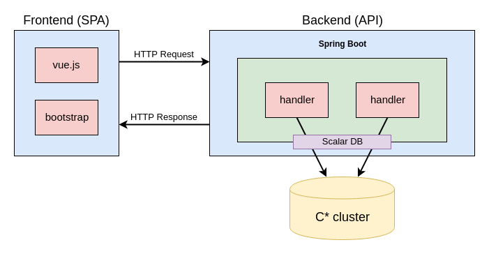

# Write your first application using Scalar DB
- [Write your first application using Scalar DB](#write-your-first-application-using-scalar-db)
    - [Set up the environment](#set-up-the-environment)
        - [Install the database model](#install-the-database-model)
        - [Deploy the REST API](#deploy-the-rest-api)
            - [Configure the Cassandra connection](#configure-the-cassandra-connection)
            - [Boot up the backend API](#boot-up-the-backend-api)
        - [Deploy the frontend](#deploy-the-frontend)
        - [Login to the application](#login-to-the-application)
        - [Post and answer to a question](#post-and-answer-to-a-question)
    - [Use Scalar DB without transaction](#use-scalar-db-without-transaction)
        - [Design the data model](#design-the-data-model)
        - [Initialize DistributedStorage](#initialize-distributedstorage)
        - [Insert and update data with Put](#insert-and-update-data-with-put)
        - [Retrieve one result with Get](#retrieve-one-result-with-get)
        - [Retrieve multiple results with Scan](#retrieve-multiple-results-with-scan)
    - [Use Scalar DB with transaction](#use-scalar-db-with-transaction)
        - [Impact on the data model](#impact-on-the-data-model)
        - [Initialize DistributedTransactionManager](#nitialize-distributedtransactionmanager)
        - [Execute a transaction](#execute-a-transaction)
        - [Handling transaction error](#handling-transaction-error)
    - [Summary](#summary)
    - [Additional Resources](#additional-resources)

In this tutorial we will use a sample Q&A application to
demonstrate the functionalities of Scalar DB. The Q&A application is a web application frontend (single page application), backend (HTTP API), and a Scalar DB supported database.



 It implements three basic Q&A features

- Question List
- Question Submission
- Answering Submission

Let's set up the environment for the demonstration so that you can try it out to have a better understanding of the functionalities. We will explain how to develop this application with Scalar DB and what differs to use Scalar DB with and without transaction.

## Set up the environment

Please install [Scalar DB prerequisites](https://github.com/scalar-labs/scalardb/blob/master/docs/getting-started.md#install-prerequisites), [Node.js](https://nodejs.org/en/download/) and [yarn](https://yarnpkg.com/en/docs/install) before running this demonstration.

### Install the database model

To install the database schema, we will use the [schema tools](https://github.com/scalar-labs/scalardb/tree/master/tools/schema) of ScalarDB.
The schema files are located inside the [/database](https://github.com/scalar-labs/indetail/tree/master/Q%26A_application/database) folder.

2 schema files are available, depending if you want to run the application using the [Storage](#use-scalar-db-without-transaction) or [Transaction](#use-scalar-db-with-transaction) mode.

Storage :

```bash
$PATH_TO_SCALARDB/tools/schema/loader schema.sdbql
```

Transaction :

```bash
$PATH_TO_SCALARDB/tools/schema/loader schema_transaction.sdbql
```

Now that the database model is set up, we can focus on starting the backend exposing an API to interact with Scalar DB.

### Deploy the REST API

**Note** : The backend code is located inside the [**/backend/QA**](https://github.com/scalar-labs/indetail/tree/master/Q%26A_application/backend/QA) folder.

The backend is a Spring boot application using gradle as the build system. Before we boot it, let's look at DB configuration file.

#### Configure the Cassandra connection

The [**scalardb.properties**](backend/QA/src/main/resources/scalardb.properties) file holds the configuration for Scalar DB. Basically, it describes the Cassandra installation that will be used.

```
#ScalarDB database configuration
scalar.database.contact_points=localhost
scalar.database.contact_port=9042
scalar.database.username=cassandra
scalar.database.password=cassandra
```

#### Boot up the backend API

The backend will expose a REST API on http://localhost:8090. The address and port can be configured in the [application.properties](https://github.com/scalar-labs/indetail/blob/master/Q%26A_application/backend/QA/src/main/resources/application.properties).

To select in which mode the backend will be launched, set the following environnement variable to **transaction** or **storage**

Storage:
```bash
export SPRING_PROFILES_ACTIVE="storage"
```
Transaction:
```bash
export SPRING_PROFILES_ACTIVE="transaction"
```

Then start the backend using a gradle wrapper

```bash
sh gradlew bootRun
```

### Deploy the frontend

To run the front end, run in the [**/frontend**](https://github.com/scalar-labs/indetail/tree/master/Q%26A_application/frontend) folder.

```bash
make
```

It will download the dependencies, build the webpack and start it.

### Login to the application

We when booted the REST API earlier, 3 users were registered in the database. Either one of them can be used to login http://localhost:8080/#/login

| Email         | Password |
| ------------- | :------: |
| user1@example.com | user1    |
| user2@example.com | user2    |
| user3@example.com | user3    |

### Post and answer to a question

After the login, the user is redirected the page containing the list of questions. No question is preregistered in the database so you need to add one by clicking on the **Submit a question** button.

On this page, you can write a title and content for a question and then submit it.

After having submitted a question, you will be redirected to the page with the question details where you can consult and add answer.

Now, if you move back to the list of question, you will see the question you just added.

In the rest of the tutorial, we will focus on how to use the ScalarDB API.

## Use Scalar DB without transaction

In this section, we will look in details how to perform atomic operations on the database by focusing on the **Question** table.

### Design the data model

The model is composed of four tables :

- Question : it represents the question posted by a user which has a title and a context
- Answer : the answer posted by a user to a question
- Account : the user accounts
- FirstQuestionDate : it records the day the first question was ever created. This field is used as the lower boundary when iterating through all of the questions recorded in the database. (Refer to the method `get(String start, int minimal)` in [QuestionServiceForStorage.java](https://github.com/scalar-labs/indetail/blob/master/Q%26A_application/backend/QA/src/main/java/com/example/qa/service/question/QuestionServiceForStorage.java) for more details)

We define these tables in [schema.sdbql](database/schema.sdbql) in format of [Scalar DB database schema](https://github.com/scalar-labs/scalardb/blob/master/docs/schema.md).

```
REPLICATION FACTOR 1;

CREATE NAMESPACE qa;

CREATE TABLE qa.question (
    date TEXT PARTITIONKEY,
    created_at BIGINT CLUSTERINGKEY,
    title TEXT,
    user TEXT,
    context TEXT,
    updated_at BIGINT,
    number_of_answers INT,
);

CREATE TABLE qa.answer (
    question_created_at BIGINT PARTITIONKEY,
    context TEXT,
    user TEXT,
    created_at BIGINT CLUSTERINGKEY,
);

CREATE TABLE qa.account (
    email TEXT PARTITIONKEY,
    password TEXT,
);

CREATE TABLE qa.firstQuestionDate (
    id TEXT PARTITIONKEY,
    first_question_date TEXT,
);
```

Looking at this schema, you might be wandering why we used a composite primary key for the **question table** since the `date` field can be inferred from timestamp `created_at`.

The first key of a composite key called **partition key**.
By default Scalar DB uses hash partioning based on the value of partition key.
The records with same values of partition key will be put (duplicated) into the same nodes.
Using hash partioning helps the scalability when a Scalar DB cluster is expanded.
Furthermore, the records in the same partition can be retrieved easily.

With this composite key design, all questions that will be created the same calendar day will have the same value for the `date` field. If we only used `created_at` as the primary key, this design would scale very well but we would not be able to retrieve multiples question with the `scan` method easily.
In summary, having this composite key ensures it will scale well while also allowing the data to be looked up easily.

Though, the current schema has its limitations. There can't be 2 questions created at the same time because these questions would have the same primary key. To avoid that we could add another id (UUID) as a second clustering key like the following.

```
CREATE TABLE qa.question (
    date TEXT PARTITIONKEY,
    created_at BIGINT CLUSTERINGKEY,
    uuid BIGINT CLUSTERINGKEY,
    title TEXT,
    user TEXT,
    context TEXT,
    updated_at BIGINT,
    number_of_answers INT,
);
```

### Initialize DistributedStorage

To use Scalar DB, the [**DistributedStorage**](https://scalar-labs.github.io/scalardb/javadoc/com/scalar/database/api/DistributedStorage.html) interface is the single point of access to the underlying database. DistributedStorage can be initiated from [Guice](https://github.com/google/guice) with StorageModule.


```java
DatabaseConfig config = new DatabaseConfig(new File(getClass().getClassLoader().getResource("scalardb.properties").getFile()));
Injector injector = Guice.createInjector(new StorageModule(config));
DistributedStorage storage = injector.getInstance(StorageService.class);
```

**Note** : refers to the class constructor and the *createDistributedStorage()* method of [LocallyConfiguredCassandraFactory.java](https://github.com/scalar-labs/indetail/blob/master/Q%26A_application/backend/QA/src/main/java/com/example/qa/dao/LocallyConfiguredCassandraFactory.java) for more details

### Insert and update data with Put

To insert a single row in the database, we will use the [**Put**](https://scalar-labs.github.io/scalardb/javadoc/com/scalar/database/api/DistributedStorage.html#put-com.scalar.database.api.Put-) method of the DistributedStorage object.

```java
// Initialize the question parameters
Put put =
    new Put(
            new Key(new TextValue("date", "20180801")),
            new Key(new BigIntValue("created_at", 1533110904000L)))
        .forNamespace("qa")
        .forTable("question")
        .withValue(new TextValue("title", "lorem ipsum"))
        .withValue(new TextValue("user", "user1@example.com"))
        .withValue(new TextValue("context", "Lorem ipsum dolor sit amet"))
        .withValue(new BigIntValue("updated_at", 1533110904000L))
        .withValue(new IntValue("number_of_answers", 0));
try {
    storage.put(put);
} catch (ExecutionException e) {
    // Handle error
}
```

**Note** : refers to the method *put(QuestionRecord record, DistributedTransaction transaction)* of [QuestionDao.java](https://github.com/scalar-labs/indetail/blob/master/Q%26A_application/backend/QA/src/main/java/com/example/qa/dao/question/QuestionDao.java) for more details.

Partial update of an entry is supported by Scalar DB. To update the data that was previously inserted, we just need to create a `Put` object what will only contains the desired modification.

```java
// Update the context and the updated_at field of the desired question
Put put =
    new Put(
            new Key(new TextValue("date", "20180801")),
            new Key(new BigIntValue("created_at", 1533110904000L)))
        .forNamespace("qa")
        .forTable("question")
        .withValue(new TextValue("context", "This is the new context."))
        .withValue(new BigIntValue("updated_at", 153311010000L));

storage.put(put);
```

**Note** : refers to the method *update(
      String date, long createdAt, long updatedAt, int numAnswer, DistributedStorage storage)* of [QuestionDao.java](https://github.com/scalar-labs/indetail/blob/master/Q%26A_application/backend/QA/src/main/java/com/example/qa/dao/question/QuestionDao.java)
      for more details.

### Retrieve one result with Get

Let's say we want to retrieve the title of the question knowing its primary key. We can use the [**Get**](https://scalar-labs.github.io/scalardb/javadoc/com/scalar/database/api/DistributedStorage.html#get-com.scalar.database.api.Get-) method.

```java
Get get = new Get(
                new Key(new TextValue("date", "20180801")),
                new Key(new BigIntValue("created_at", 1533110904000L)))
            .forNamespace("qa")
            .forTable("question");
try {
    Optional<Result> optResult = storage.get(get);
    if (optResult.isPresent()) {
        Result result = optResult.get();
        String title = ((TextValue) result.getValue("title").get()).getString().get();
    }
} catch (ExecutionException e) {
    // Handle the error
}
```

**Note** : refers to the method *get(String date, long createdAt, DistributedStorage storage)* of [QuestionDao.java](https://github.com/scalar-labs/indetail/blob/master/Q%26A_application/backend/QA/src/main/java/com/example/qa/dao/question/QuestionDao.java)
      for more details.

### Retrieve multiple results with Scan

The [**Scan**](https://scalar-labs.github.io/scalardb/javadoc/com/scalar/database/api/DistributedStorage.html#scan-com.scalar.database.api.Scan-) method is used to retrieve all the records sharing the same partition key. In this example, we use it to retrieve all the questions that were created on the same day.

It is to be noted that ordering of results of a Scan is dependent on the underlining implementations, so you need to explicitly specify the ordering of results (ascendant or descendant) if desired. The ordering can only be performed on the clustering key.

```java
Scan scan = new Scan(new Key(new TextValue("date","20180801")))
        .forNamespace("qa")
        .forTable("question")
        .withOrdering(new Ordering("created_at", Ordering.Order.DESC));
try {
    List<Result> scanner = storage.scan(scan);
    for (Result result : scanner) {
        //parse the result
    }
} catch (ExecutionException e) {
    //Handle the error
}
```

**Note** : refers to the method *update(
      String date, long createdAt, long updatedAt, int numAnswer, DistributedStorage storage)* of [QuestionDao.java](https://github.com/scalar-labs/indetail/blob/master/Q%26A_application/backend/QA/src/main/java/com/example/qa/dao/question/QuestionDao.java)
      for more details.

## Use Scalar DB with transaction

The problem is that without using transaction, performing some kind of business logic on the database is very risky because another thread could be doing it at the same time. Consequently, the possibility of having unexpected behavior was really high.

For this reason, we also decided to implement a thread safe implementation of the backend using transaction. A transaction in Scalar DB follows the same principle of a RDBMS transaction. In other words, it makes it possible to group several operations (write and/or read) together to be executed in an atomic way.

### Impact on the data model

To apply transaction, we can just add a keyword `TRANSACTION` before table name in Scalar DB scheme. For instance, we modify our qa.question talbe.
```
CREATE TRANSACTION TABLE qa.question (
  date TEXT PARTITIONKEY,
  created_at BIGINT CLUSTERINGKEY,
  title TEXT,
  user TEXT,
  context TEXT,
  updated_at BIGINT,
  number_of_answers INT,
);
```

### Initialize DistributedTransactionManager

To initialize DistributedTransactionManager, we can use Guice with TransactionModule.
```
DatabaseConfig config = new DatabaseConfig(new File(getClass().getClassLoader().getResource("scalardb.properties").getFile()));
Injector injector = Guice.createInjector(new TransactionModule(config));
DistributedTransactionManager transaction = injector.getInstance(TransactionModule.class);
```

**Note** : refers to the method *createDistributedTransactionManager()* of [LocallyConfiguredCassandraFactory.java](https://github.com/scalar-labs/indetail/blob/master/Q&A_application/backend/QA/src/main/java/com/example/qa/dao/LocallyConfiguredCassandraFactory.java) for more details.

### Execute a transaction

A `DistributedTransaction` can be retrieved from the **transactionManager**. Then use this objects to execute the desired operations and eventually commit them.

```java
//Create the transaction
DistributedTransaction transaction = transactionManager.start();
//Perform the operations you want to group in the transaction
Get get = new Get(
                new Key(new TextValue("date", "20180801")),
                new Key(new BigIntValue("created_at", 1533110904000L)))
                .forNamespace("qa")
                .forTable("question");
Optional<Result> optResult = transaction.get(get);

Put put = new Put(...);
transaction.put(put);

Delete delete = new Delete(...);
transaction.delete(delete);

//When all operations are completed, commit the transaction
transaction.commit();
```

### Handling transaction error

The transaction `commit()` method could throw 2 kind of exceptions :

- `CommitException` which indicates a commit has failed. In that case, it is recommended to roll back the transaction using `transaction.abort()`
- `UnknownTransactionStatusException` indicates the transaction commit is in an unknown status. It may or not have been committed.

## Summary

This tutorial first explained how to set up the Q&A application before it showed how to instantiate the database model, and finally write and read data using Scalar DB.

## Additional Resources

For more information about the Scalar DB please refer to:

- Getting Started : https://github.com/scalar-labs/scalardb/blob/master/docs/getting-started.md
- Design Document : https://github.com/scalar-labs/scalardb/blob/master/docs/design.md
- Javadoc : https://scalar-labs.github.io/scalardb/javadoc/

On the other hand, if you are looking for concrete implementations examples and best practices, please take a look at the Q&A application source code.
